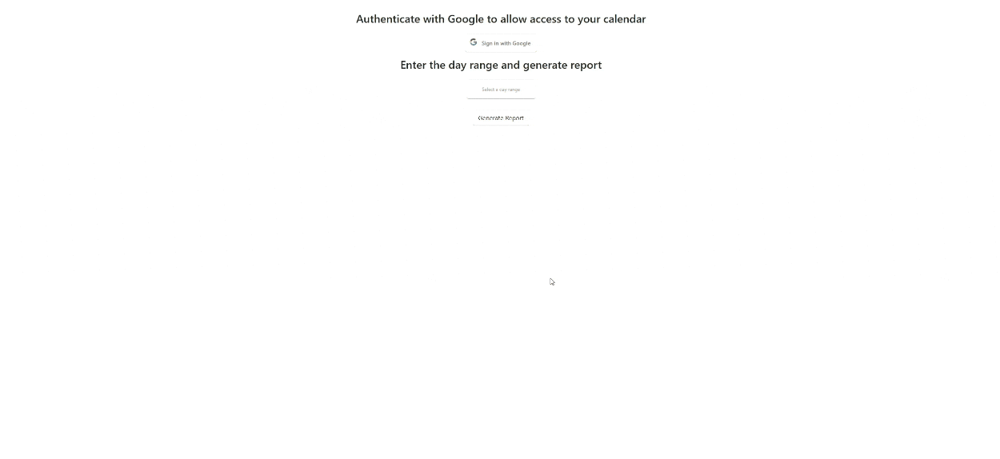

### Google Calendar Exporter 📅📝
- Simple application that will connect with your google calendar and export it to a CSV.
- Visit Site [https://googlecalexporter.netlify.app/](https://googlecalexporter.netlify.app/).
- ⭐⭐ NOTE the site will not work with gmail address as you're not an authorized email. This app is not published yet through google ⭐⭐

---

 

# ⭐ How to use
- Need to get your own client ID and API key from google api. Learn more at https://developers.google.com/calendar/api/quickstart/js
- Create a .env file and enter client / api key
- Run npm install 
- Run npm start 

# 👨‍💻 Tech stack
- This site was created with create-react-app. 

 

---

